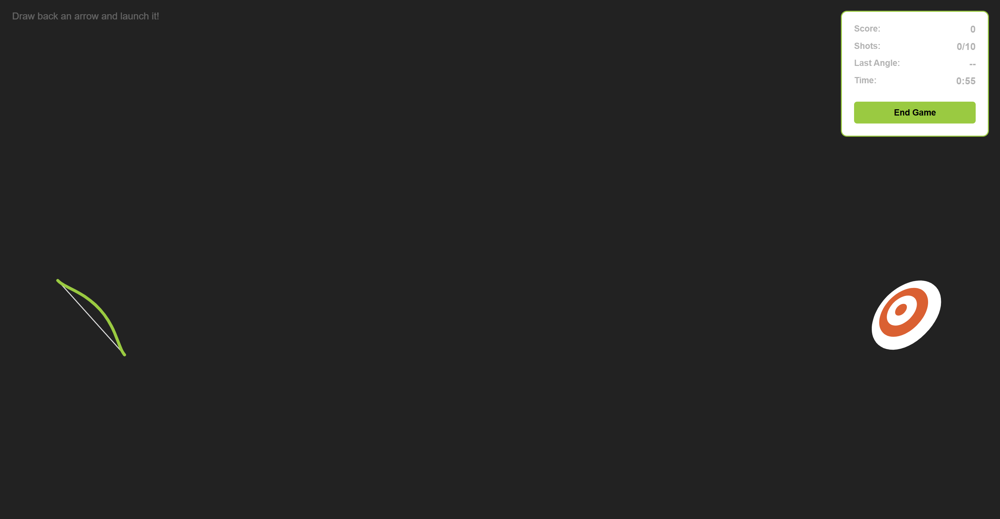
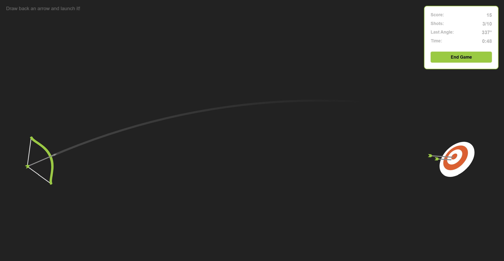
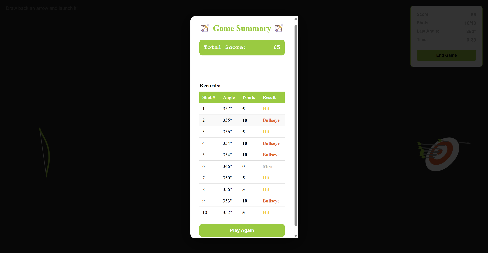

# 🏹 Archery Game

An interactive browser-based archery game built with vanilla JavaScript, SVG animations, and GSAP. Test your aim and precision by shooting arrows at a target with realistic physics and a challenging random angle mechanic!

## 📋 Table of Contents

- [Features](#features)
- [Quick Start](#quick-start)
- [Installation](#installation)
- [How to Use](#how-to-use)
- [Game Rules](#game-rules)
- [Screenshots](#screenshots)

## ✨ Features

- **Interactive Gameplay**: Draw back your bow and release arrows with mouse controls
- **Realistic Physics**: Arrows follow curved trajectories with smooth animations
- **Random Angle Challenge**: Each shot has a slight random angle variation to increase difficulty
- **Scoring System**:
  - 🎯 **Bullseye**: 10 points
  - 🎪 **Hit**: 5 points
  - ❌ **Miss**: 0 points
- **Game Statistics**: Track your score, shots taken, launch angles, and remaining time
- **Time Limit**: 60-second countdown timer
- **Shot Limit**: Maximum of 10 shots per game
- **Detailed Summary**: View comprehensive game statistics and shot-by-shot breakdown
- **Responsive Design**: Playable on various screen sizes

## 🚀 Quick Start

1. Clone the repository
2. Open `index.html` in your web browser
3. Click and drag to draw back the bow
4. Release to shoot
5. Try to hit the bullseye!

## 💻 Installation

### Option 1: Direct Download

1. Download or clone this repository:
```bash
git clone https://github.com/yourusername/archery-game.git
```

2. Navigate to the project directory:
```bash
cd archery-game
```

3. Open `index.html` in your preferred web browser

### Option 2: Run with Live Server (Recommended for Development)

1. If using VS Code, install the "Live Server" extension
2. Right-click on `index.html`
3. Select "Open with Live Server"

### Files Structure
```
archery-game/
│
├── index.html          # Main HTML file
├── style.css           # Styling and layout
├── script.js           # Game logic and animations
├── screenshots/        # Game screenshots
│   ├── gameplay.png
│   ├── aiming.png
│   └── summary.png
└── README.md          # This file
```

## 🎮 How to Use

### Starting the Game

1. Open the game in your browser
2. The game starts automatically with a 60-second timer
3. You have 10 shots to score as many points as possible

### Playing the Game

1. **Aim**: Move your mouse to aim the bow at the target
2. **Draw**: Click and hold the mouse button to draw back the arrow
   - The further you pull back, the more power your shot will have
3. **Release**: Release the mouse button to shoot the arrow
4. **Watch**: The arrow will arc through the air toward the target
5. **Repeat**: Continue shooting until you run out of time or shots

### Scoring

- Your current score is displayed in the top-right stats panel
- Each shot's angle is recorded and shown
- The timer counts down from 60 seconds

### Ending the Game

The game ends when:
- You've taken all 10 shots
- The 60-second timer reaches zero
- You click the "End Game" button

### Viewing Results

After the game ends:
- A summary modal appears with your final statistics
- View your total score, average score per shot, and time played
- See a detailed table of each shot including angle, points, and result
- Click "Play Again" to start a new game

## 📖 Game Rules

1. **Objective**: Score as many points as possible within the time and shot limits
2. **Controls**: Mouse only - click, drag, and release to shoot
3. **Scoring**:
   - Landing in the red center = 10 points (Bullseye)
   - Landing in the outer rings = 5 points (Hit)
   - Missing the target = 0 points (Miss)
4. **Challenge**: Each shot has a random angle variation making precise aiming difficult
5. **Limits**: 10 shots maximum, 60 seconds time limit

## 📸 Screenshots

<p align="center">
  
  
  
</p>

<p align="center">
  <em>Main gameplay interface | Drawing the bow | Game summary with statistics</em>
</p>

---

**Have fun and good luck hitting that bullseye! 🎯**

*Pull requests and suggestions are welcome!*
